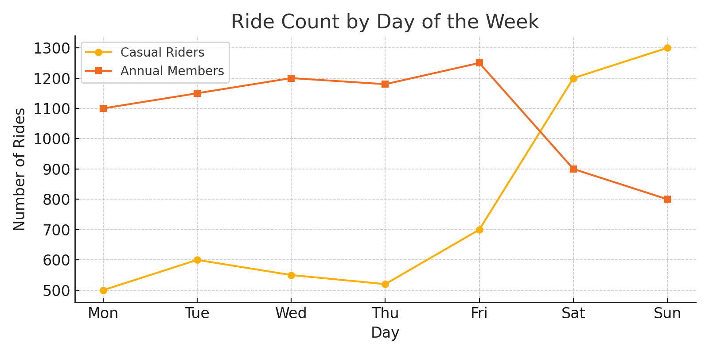
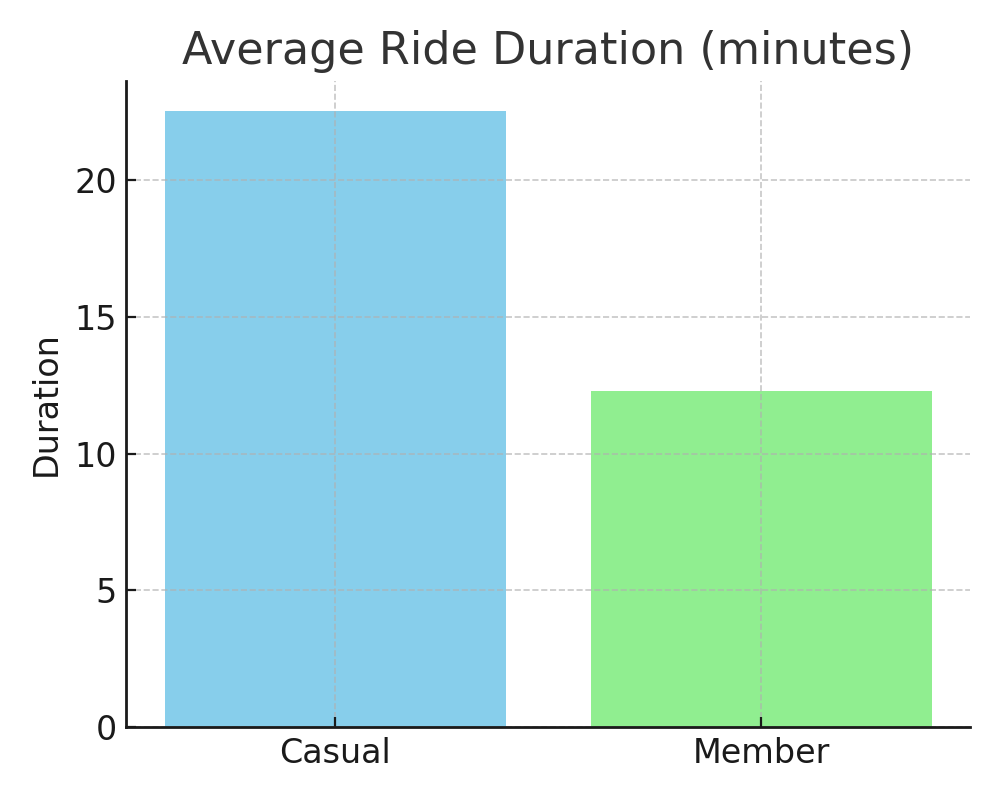
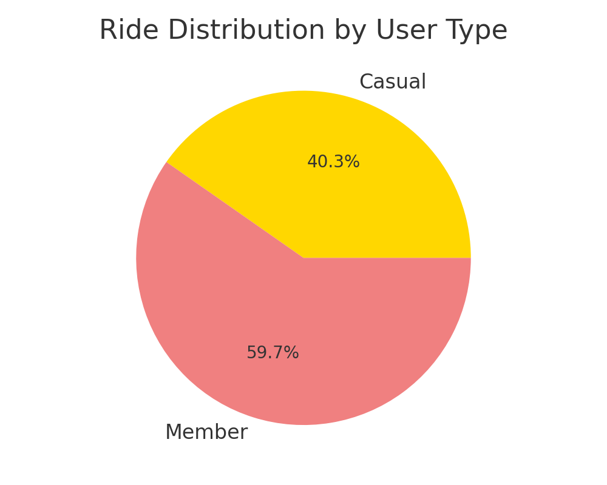

# Cyclistic Bike-Share Case Study 🚲

## 📝 Project Title
Cyclistic Bike-Share Case Study

## 👤 Author
By Sainivas

## 📊 Tools Used
- Excel
- Data Cleaning
- Pivot Tables
- Charts (Line, Bar, Pie)

## 📁 Dataset
Divvy Public Bike-Share Data (2022)

---

## 📌 Overview
Cyclistic is a bike-share program in Chicago with over 5,800 bicycles and 600+ docking stations. The company wants to grow its subscriber base by converting more casual riders into annual members.

---

## 🎯 Objective
To analyze the differences in usage patterns between **casual riders** and **annual members**, and provide **data-driven recommendations** to increase annual memberships.

---

## 🔍 Key Analysis Performed
- Cleaned and prepared trip data using Excel  
- Analyzed ride duration, day-of-week patterns, and rider types  
- Created visualizations: line, bar, and pie charts  

---

## 📈 Insights
- Casual riders prefer riding on weekends, with longer ride durations  
- Annual members ride more consistently on weekdays  
- Casual rides spike on Saturdays and Sundays  

---

## ✅ Recommendation
Cyclistic should target casual riders with weekend promotions and encourage membership through discounted trials or loyalty offers.

---

## 📷 Visuals
  
  

---

## 📄 Case Study Report
Download the [Cyclistic Case Study PDF](Cyclistic_Case_Study.pdf)
